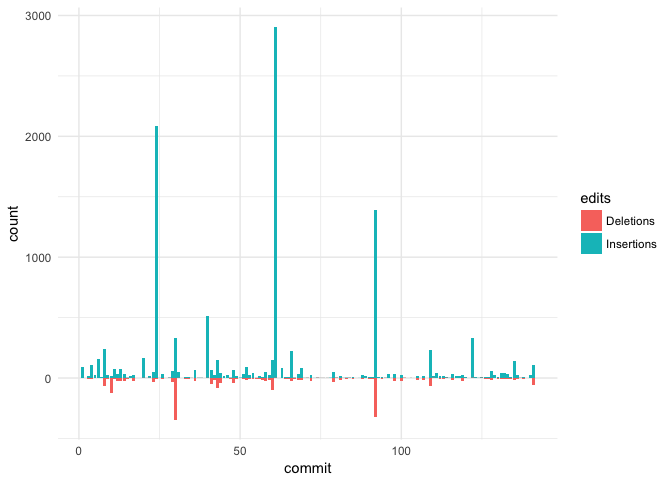
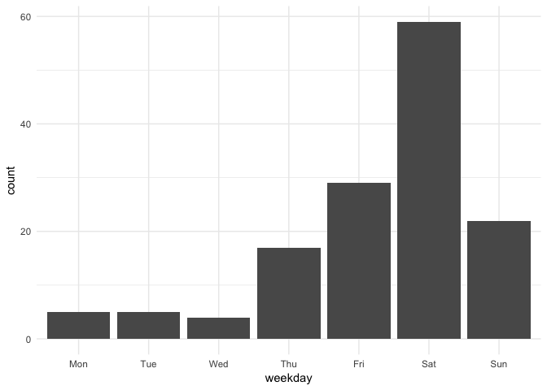

<!-- README.md is generated from README.Rmd. Please edit that file -->
*Package is work in progress!*

Introduction
============

This package parses a git repository history to collect comprehensive information about the activity in the repo. The parsed data is made available to the user in a tabular format. To parse the git repo history, use `get_log_regex`. For each commit, the function also outputs information on which files were changed in a nested tibble.

``` r
library("gitsum")
library("tidyverse")
library("forcats")
```

``` r
tbl <- get_log_regex() %>%
  select(short_hash, message, total_files_changed, nested)
tbl 
#> # A tibble: 14 x 4
#>    short_hash
#>         <chr>
#>  1       243f
#>  2       f8ee
#>  3       6328
#>  4       dfab
#>  5       7825
#>  6       2ac3
#>  7       7a2a
#>  8       943c
#>  9       917e
#> 10       4fc0
#> 11       7be6
#> 12       90df
#> 13       5d32
#> 14       29ba
#> # ... with 3 more variables: message <chr>, total_files_changed <int>,
#> #   nested <list>
```

``` r
tbl$nested[[3]]
#> # A tibble: 3 x 6
#>   changed_file edits deletions insertions deletions_symbol
#>          <chr> <int>     <int>      <int>            <chr>
#> 1  DESCRIPTION     6         1          5                -
#> 2    NAMESPACE     3         1          2                -
#> 3  R/get_log.R    19         8         11         --------
#> # ... with 1 more variables: insertions_symbol <chr>
```

Since the data has such a high resolution, various graphs, tables etc can be produced from it to provide insights into the git history.

Examples
========

Since the output of `get_log_regex()` is a nested tibble, you can work on it as you work on any other tibble. Let us first have a look at who comitted to this repository:

``` r
log <- get_log_regex()
log %>%
group_by(author_name) %>%
  count()
#> # A tibble: 2 x 2
#>       author_name     n
#>             <chr> <int>
#> 1      jonmcalder     2
#> 2 Lorenz Walthert    12
```

Next, we want to see which files were contained in most commits:

``` r
log %>%
  unnest(nested) %>% # unnest the tibble
  mutate(changed_file = fct_infreq(changed_file)) %>%
  ggplot(aes(x = changed_file)) + geom_bar() + coord_flip() + 
  theme_minimal()
```


We can also easily get a visual overview of the number of insertions & deletions in commits over time:

``` r
commit.dat <- data.frame(
    edits = rep(c("Insertions", "Deletions"), each = nrow(log)),
    commit = rep(1:nrow(log), 2),
    count = c(log$total_insertions, -log$total_deletions))
    
ggplot(commit.dat, aes(x = commit, y = count, fill = edits)) + 
  geom_bar(stat = "identity", position = "identity") +
  theme_minimal()
#> Warning: Removed 8 rows containing missing values (geom_bar).
```



Or the number of commits broken down by day of the week:

``` r
log %>%
  mutate(weekday = factor(weekday, c("Mon", "Tue", "Wed", "Thu", "Fri", "Sat", "Sun"))) %>% 
  ggplot(aes(x = weekday)) + geom_bar() + 
  theme_minimal()
```


